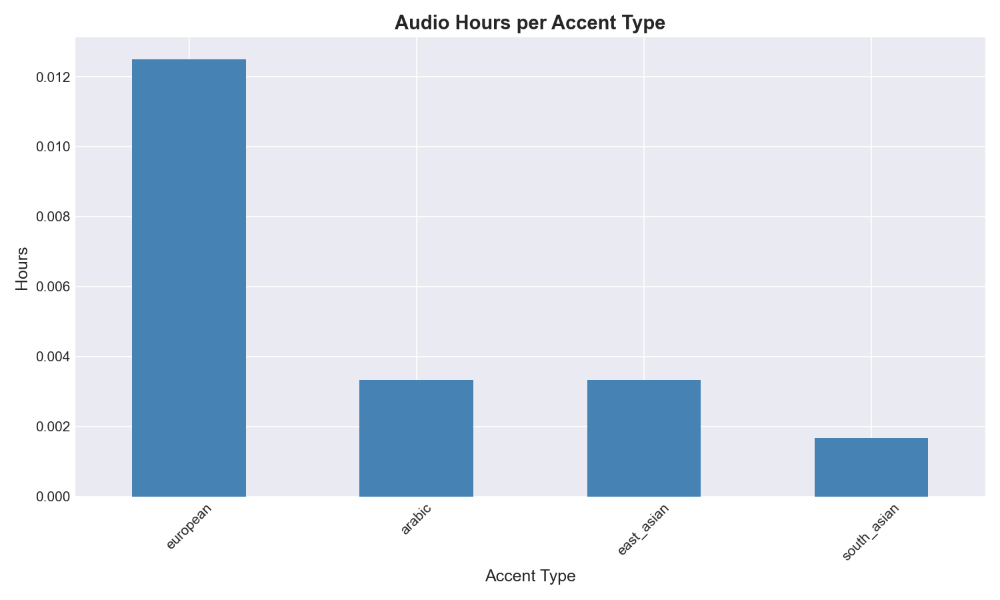
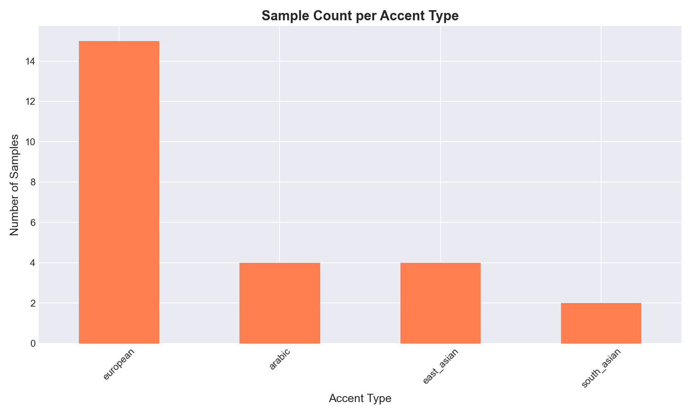
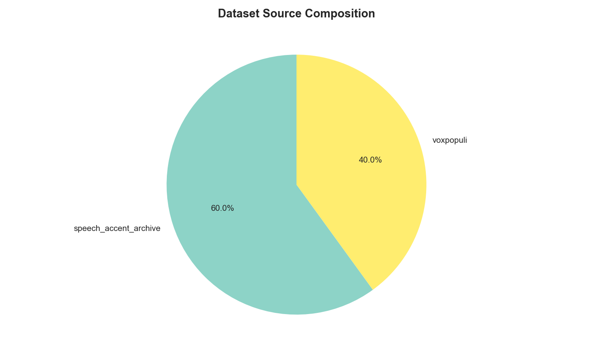
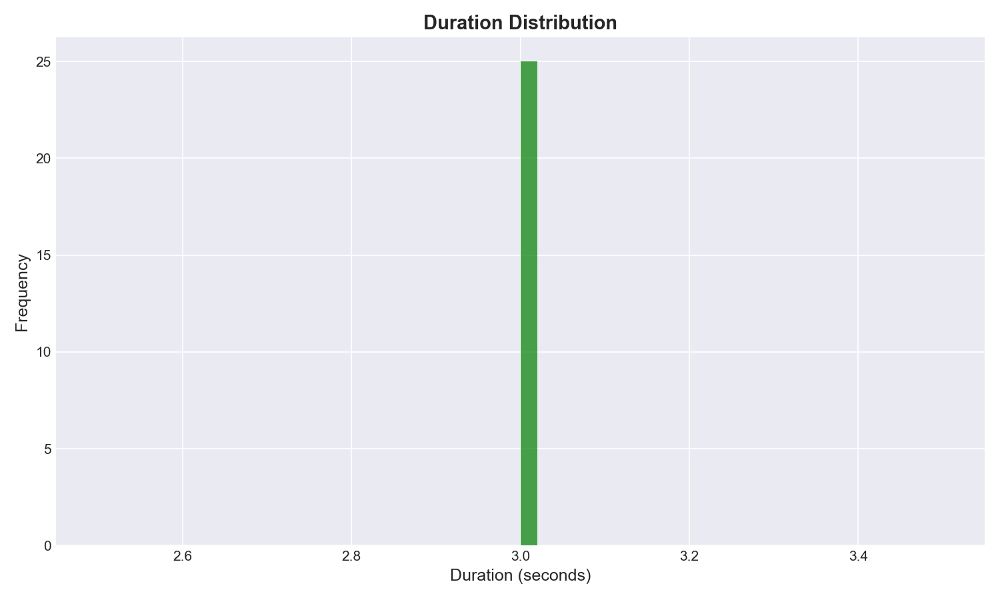
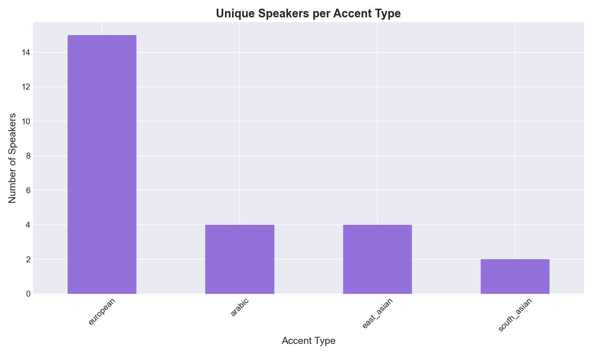

# Dataset Statistics Report

## Executive Summary

This report provides a comprehensive analysis of the accent recognition dataset compiled from multiple sources.

## Dataset Overview

### Total Statistics
- **Total Audio Files:** 25
- **Total Duration:** 0.0 hours
- **Average Duration:** 3.00 seconds
- **Duration Range:** 3.00s - 3.00s
- **Unique Speakers:** 25
- **Unique Accent Types:** 4
- **Data Sources:** 2

### Breakdown by Accent Type

| Accent Type | Samples | Total Hours | Avg Duration |
|---|---|---|---|
| arabic | 4 | 0.0 | 3.00s |
| east_asian | 4 | 0.0 | 3.00s |
| european | 15 | 0.0 | 3.00s |
| south_asian | 2 | 0.0 | 3.00s |

### Breakdown by Dataset Source

| Source | Samples | Total Hours |
|---|---|---|
| speech_accent_archive | 15 | 0.0 |
| voxpopuli | 10 | 0.0 |

## Visualizations

*Figure 1: Total audio hours per accent type*

*Figure 2: Sample count per accent type*

*Figure 3: Dataset source composition*

*Figure 4: Duration distribution of audio samples*

*Figure 5: Unique speakers per accent type*

## Data Quality Notes

- All statistics calculated from master manifest
- Duration values computed from actual audio loading
- Missing values excluded from analysis
- Speaker independence: Each speaker appears in only one split (handled in split phase)

## Recommendations

1. **Minimum samples**: Ensure at least 50 samples per accent in test set
2. **Speaker balance**: Try to balance speakers across train/val/test
3. **Duration**: Consider stratified sampling by duration ranges
4. **Data augmentation**: Consider augmentation for underrepresented accents

## Next Steps

- Phase 3.3: Create balanced train/validation/test splits
- Phase 4: Quality assurance and data validation
- Phase 5: Begin model training and evaluation

---

*Report generated automatically*
